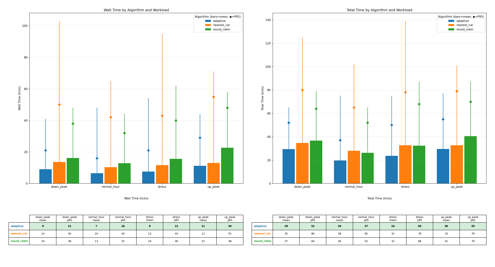

# LiftOS

A discrete-event elevator simulator for evaluating scheduling algorithms. Passengers arrive according to configurable traffic patterns, elevators move one floor per tick using a LOOK sweep, and a pluggable scheduler decides which car serves each request. Every run produces structured logs and comparison charts.

## Setup

Requires Python 3.12+. Install with [uv](https://docs.astral.sh/uv/):

```bash
uv sync
```

Run the test suite:

```bash
uv run pytest
```

## Running a Benchmark

The `liftos` CLI runs one or more workload-algorithm combinations and writes results to a timestamped directory.

```bash
uv run liftos \
  --floors 20 --elevators 6 --capacity 8 --passengers 500 \
  --workload up_peak --workload down_peak --workload normal_hour --workload stress \
  --algorithm round_robin --algorithm nearest_car --algorithm adaptive \
  --seed 42 --output logs
```

Each run produces:
- `manifest.json` with the full configuration and git commit hash
- Per-combination JSONL logs (elevator state, passenger lifecycle, dispatch decisions)
- `results.png` comparison chart when multiple workloads or algorithms are specified

### CLI Reference

| Flag | Required | Default | Description |
|------|----------|---------|-------------|
| `--floors` | yes | | Number of floors in the building |
| `--elevators` | yes | | Number of elevator cars |
| `--passengers` | yes | | Number of passengers to simulate |
| `--workload` | yes | | Traffic pattern (repeatable) |
| `--algorithm` | yes | | Scheduling strategy (repeatable) |
| `--capacity` | no | 8 | Max passengers per car |
| `--seed` | no | 42 | Random seed for reproducibility |
| `--max-ticks` | no | 2500 | Safety bound on simulation length |
| `--output` | no | `./logs` | Base output directory |

## Workloads

| Workload | Description |
|----------|-------------|
| `up_peak` | Morning rush. 80% of passengers start at ground floor and travel to random upper floors. Arrival rate 0.5. |
| `down_peak` | Evening rush. All passengers start on upper floors and travel to ground. Arrival rate 0.5. |
| `normal_hour` | Mid-day inter-floor traffic. Random origins and destinations across all floors. Arrival rate 0.3. |
| `stress` | Load spike. Baseline rate 0.3 with a 2.0x burst from 30% to 50% of total duration. Tests behavior under sudden congestion. |

All workloads use Poisson arrivals with exponential inter-arrival times. The seed parameter makes them deterministic.

## Scheduling Algorithms

### Round Robin

Cycles through cars in order: request 0 goes to car 0, request 1 to car 1, and so on. Simple and fair, but ignores car position, direction, and load.

### Nearest Car

Assigns each request to the car closest to the pickup floor (Manhattan distance). Tie-breaks by car ID. Fast pickup when cars are idle, but ignores load and can overload cars near demand centers.

### Adaptive

Weighted multi-factor scorer. Each candidate car is scored on three normalized [0,1] components:

| Component | Weight | What it measures |
|-----------|--------|------------------|
| **ETA** | 0.4 | Estimated ticks to reach pickup floor, accounting for current direction and pending stops |
| **Ride** | 0.2 | Estimated ticks from pickup to dropoff, including intermediate stops for existing passengers |
| **Load** | 0.4 | Occupancy ratio including both onboard and assigned-but-waiting passengers |

Lowest total score wins. Three optimizations layer on top of the base scorer:

**Assigned-aware load.** The load calculation includes passengers already assigned to a car but not yet picked up. This prevents the scorer from piling multiple requests onto the same car within a single tick batch.

**Capacity overflow penalty.** When a car's committed passengers (onboard + assigned) meet or exceed capacity, the ETA gets a `2 * num_floors` round-trip penalty. The passenger won't board on the first visit, so the estimate must reflect the extra travel.

**Pickup deadline penalty.** Inspired by the [Linux deadline I/O scheduler](https://www.cloudbees.com/blog/linux-io-scheduler-tuning). When the estimated ETA exceeds `num_floors * 0.75` ticks, a penalty proportional to the overshoot is added to the score. Under calm traffic, ETAs stay below the threshold and the penalty is zero. During spikes, distant cars get penalized and the scorer converges toward nearest-car behavior. This self-regulation closes the tail latency gap without sacrificing mean performance.

### Idle Redistribution

Independent of the scheduler, idle cars are proactively moved toward high-demand floors. A demand tracker records which floors generate the most requests. Each tick, idle cars move one floor toward the highest-demand floor that doesn't already have 50% of the fleet parked there. This reduces pickup time for the next wave of requests.

## Simulation Viewer

A browser-based replay tool for visualizing benchmark runs. Animated elevator shafts, live stats, and real-time charts update as the simulation plays back tick by tick.

[Watch the demo (docs/demo.mov)](docs/demo.mov)

**Features:** animated SVG building with car movement and direction indicators, per-floor waiting passenger counts, four live line charts (wait time, total time, car occupancy, throughput), running mean/p95 stats, scrubber and speed control (1-100x), keyboard shortcuts (Space, arrows). Switch between algorithms and workloads mid-replay to compare behavior.

```bash
cd webapp && npm install && npm run dev
```

See [webapp/README.md](webapp/README.md) for details.

## Benchmark Results

20 floors, 6 elevators, capacity 8, 500 passengers, seed 42.



| Workload | Metric | Adaptive | Round Robin | Nearest Car |
|----------|--------|----------|-------------|-------------|
| up_peak | wait mean / p95 | **11 / 29** | 23 / 48 | 13 / 55 |
| up_peak | total mean / p95 | **30 / 55** | 41 / 70 | 33 / 79 |
| down_peak | wait mean / p95 | **9 / 21** | 16 / 38 | 14 / 50 |
| down_peak | total mean / p95 | **29 / 52** | 37 / 64 | 35 / 80 |
| normal_hour | wait mean / p95 | **7 / 16** | 13 / 32 | 10 / 42 |
| normal_hour | total mean / p95 | **20 / 37** | 26 / 52 | 28 / 65 |
| stress | wait mean / p95 | **8 / 21** | 16 / 40 | 12 / 43 |
| stress | total mean / p95 | **24 / 50** | 32 / 68 | 33 / 78 |

Adaptive wins on mean and p95 across every workload and metric.

## Optimization Journey

The adaptive scheduler went through four stages of development. Each change was benchmarked against the same 500-passenger, 20-floor, 6-car configuration.

### Stage 1: Baseline Adaptive

The initial scorer weighted ETA (0.2), ride (0.2), and load (0.6). Heavy load weighting kept cars balanced but sent passengers to distant empty cars during traffic spikes. On the stress workload, adaptive's p95 wait was 180 ticks -- worse than round-robin's 151.

### Stage 2: Idle Redistribution

Added a demand tracker that records which floors generate the most requests, and a redistribution phase that guides idle cars toward those floors. A 50% fleet cap per floor prevents over-concentration. This cut down_peak wait mean from 14 to 9 ticks and stress wait p95 from 180 to 176. The biggest gains were on directional workloads (up_peak, down_peak) where pre-positioning idle cars near demand centers directly reduces pickup distance.

### Stage 3: Weight Tuning

Rebalanced weights from (0.2/0.2/0.6) to (0.4/0.2/0.4). Increasing the ETA weight made the scorer more responsive to distance, while reducing load weight relaxed the over-spreading that caused distant-car assignments. Normal-hour p95 improved from 19 to 17, and up_peak p95 from 37 to 27. Stress p95 regressed slightly (176 to 187) -- the scorer needed a mechanism to handle spike traffic specifically.

### Stage 4: Deadline-Aware Scheduling

The remaining tail latency gap came from spike traffic: the scorer would assign passengers to distant but empty cars, creating outlier wait times. The fix, inspired by the Linux deadline I/O scheduler, adds three changes:

1. **Assigned-aware load** -- count passengers already assigned but not yet picked up toward the car's load score, preventing multiple requests from piling onto the same car in a single tick.
2. **Capacity overflow penalty** -- add a round-trip ETA penalty for cars already at capacity, since the passenger won't board on the first visit.
3. **Pickup deadline penalty** -- when estimated ETA exceeds `num_floors * 0.75`, add a score penalty proportional to the overshoot. This self-regulates: zero under calm traffic, dominant during spikes.

The deadline threshold of 0.75 was found by sweeping 0.5--2.0. Sensitivity is non-monotonic (0.7 and 0.8 are worse than 0.75), so the parameter should not be changed without re-benchmarking.

Result: stress wait p95 dropped from 187 to **135** (beating round-robin's 151), and stress total p95 dropped from 214 to **162** (beating round-robin's 178). Adaptive now wins on mean and p95 across every workload.
